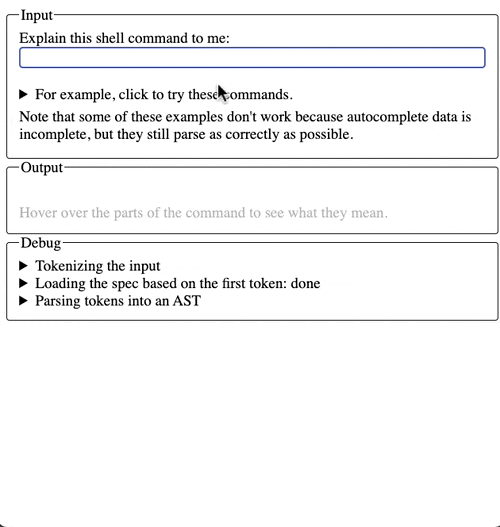

# fig-explainshell-clone

A lightweight clone of [explainshell.com](https://explainshell.com/) that pulls
help info from [withfig/autocomplete](https://github.com/withfig/autocomplete).

## Demo

## Running the app

    npm install
    npm start

## Design decisions

I decided to work on the parser, as that part was the most novel and thus more
interesting part to me. Because of this, the styling is lightweight. I chose
styling that is readable, not ugly, and compatible with any screen size.

Here's the order in which different edge cases started being handled:

1. Tokenizing the input
2. Parsing subcommands: `command subcommand --option1 --option2`
3. Parsing options: `command --option1 --option2`
4. Parsing fixed (sub)command args: `command arg1 --option1 arg2 arg3 --option2`
5. Parsing variadic (sub)command args: `command arg1 arg2 arg2 arg2 arg3`
6. Parsing option args: `command arg1 --option1 option1arg1 arg2 arg3 --option2`
7. Parsing short options: `command arg1 -abcd option-d-arg --long-option`
8. Tokenizing backslashes and mixed quotes properly

Edge cases not handled:

- Short option with attached argument: `git commit -mmessage`
- Short option, equal sign, argument: `git commit -m=message`
- Arguments for the command specified after the subcommand: `npm -g i package`
- Shell syntax; i.e., anything not related to running a single command-line
  program.

I chose the order in which edge cases were handled based on two factors:

- Difficulty. I wanted to get something demoable asap. Subcommands are parsed
  exactly the same way as commands, so I did that first. Options were easier
  than arguments to get to a correct-ish state, so I did that next.
- Inherent interestingness. Improving tokenization is a problem that is easy to
  solve and didn't feel core to the problem at hand because it doesn't directly
  relate to the help text content. I didn't work on the two final ways of
  passing arguments to options because I belive they add too much complexity
  with no benefit over the the `-m message` approach -- I think shell tooling
  would be simpler to build if those arg-passing conventions didn't exist!
- Completeness. I opted to not work on shell syntax because I wanted to create a
  robust product for showing help for a single command first.

Ideas for improvement:

- The autocomplete data could be better! I was almost tempted to add in missing
  autocomplete data for the examples that don't work.
- When autocomplete data is missing or incorrect, the parser stops parsing after
  encountering unknown options. This is because, without the specs for the
  option, we don't know if the following arguments and options are for the
  (sub)command or for the option. The UI has an error state indicating this, but
  the error state doesn't include any of the unparsed args. It probably should.
- Even though I chose to not work on it, I have some ideas for how the UI could
  be better. The most important one is that unless the command is very long, all
  help text should be immediately visible to the user. Like explainshell,
  hovering over a part of the command should highlight the explanation for that
  part. One thing I would unintuitive about explainshell is that the
  explanations are vertically laid out while commands are horizontally laid out.
  I wonder if it's a good idea for the explanations to scroll horizontally in a
  way that syncs with what part of the command is being hovered over.
- The UI does not display the command in exactly the same way it was entered. It
  shows the parsed version, with quote marks and backslahes removed, and options
  are always shown before arguments (although the order of options is
  preserved). This could be good for showing the user how the command is
  interpreted and that different ways of entering the command are equivalent.
  However, there should be a "raw mode" that shows the command as entered.
- This kind of UI could be useful for explaining lots of other written things:
  prose langues and math come to mind. If there was a universal UI for this that
  could also work for those domains, that would be helpful.
